# EM — Operational Awareness Playbook

**Context:** B2C Engineering, Groupon | **Version:** 1.0 | **Updated:** 2026-02-09
**Audience:** Engineering Manager / EM managing 4-10 ICs
**Architecture:** 6 Domain DAGs + 1 Decision Gate
**Principle:** Every node = Source → Query → Threshold → Interpretation → Action

---

## Key Differences: EM vs VP

| Dimension | VP (Viktor's playbook) | EM (this playbook) |
|-----------|----------------------|---------------------------|
| Scope | 7+ teams, 50+ people | 1 tribe, 4-10 ICs |
| Time horizon | Quarterly strategy | Sprint-level execution |
| Primary lever | Delegation, narrative, politics | Unblocking, coaching, quality |
| Technical depth | Broad, signal-level | Deep, code-level |
| People work | EM health + succession | IC growth + engagement |
| Upward reporting | Board narrative | 5/15 + sprint demos |
| Incident role | Escalation decision | Hands-on investigation lead |
| Biggest risk | Losing the narrative | Losing an IC silently |

---

## 0. MASTER ORCHESTRATION — EM DAILY RHYTHM

```mermaid
flowchart LR
    subgraph RHYTHM["⏰ DAILY RHYTHM"]
        AM["☀️ MORNING\n08:00-09:00"]
        MID["🔥 MID-DAY\n12:00-12:30"]
        PM["🌙 END-OF-DAY\n17:00-17:30"]
        SPRINT["🏃 SPRINT EVENTS\nPlanning / Retro / Demo"]
        WEEKLY["📊 WEEKLY\n5/15 + VP 1:1"]
    end

    subgraph DAGS["🗂️ DOMAIN DAGS"]
        D1["DAG 1\nSprint &\nDelivery"]
        D2["DAG 2\nPeople &\nGrowth"]
        D3["DAG 3\nCode &\nQuality"]
        D4["DAG 4\nProduction &\nIncidents"]
        D5["DAG 5\nDependencies &\nCommunication"]
    end

    subgraph GATE["🎯 ACTION GATE"]
        TRIAGE{{"WHAT NOW?"}}
        UNBLOCK["UNBLOCK\nRemove obstacle for IC"]
        COACH["COACH\n1:1, feedback, grow"]
        SHIELD["SHIELD\nProtect team from noise"]
        ESCALATE["ESCALATE\nTo VP with context"]
    end

    AM --> D1
    AM --> D4
    MID --> D3
    MID --> D5
    PM --> D2
    SPRINT --> D1
    WEEKLY --> D2

    D1 -->|Stuck| TRIAGE
    D2 -->|Signal| TRIAGE
    D3 -->|Quality drop| TRIAGE
    D4 -->|Incident| TRIAGE
    D5 -->|Blocked| TRIAGE

    TRIAGE -->|IC blocked| UNBLOCK
    TRIAGE -->|IC struggling| COACH
    TRIAGE -->|External noise| SHIELD
    TRIAGE -->|Beyond your scope| ESCALATE
```



**Morning routine (08:00-09:00 CET):**

| Time | Action | Source | Duration |
|------|--------|--------|----------|
| 08:00 | Scan Jira board — new blockers, stale tickets | Jira board view | 5min |
| 08:05 | Check incident pulse — anything overnight? | JPROD/GPROD or Grafana | 3min |
| 08:10 | Scan PRs — anything waiting >24hrs for review? | GitHub/GitLab PR list | 5min |
| 08:15 | Read chat — anything from ICs needing unblock? | Google Chat / Slack | 5min |
| 08:25 | Mental model: Who is stuck? Who needs me? | Internal assessment | 5min |
| 08:30 | Standup (if applicable) | Team standup | 15min |

**End-of-day routine (17:00-17:30 CET):**

| Time | Action | Source | Duration |
|------|--------|--------|----------|
| 17:00 | Board scan — did anything move today? | Jira board | 5min |
| 17:05 | PR check — anything I need to review tonight? | GitHub/GitLab | 5min |
| 17:10 | Recognition scan — did anyone ship something worth calling out? | Jira + Git + Chat | 5min |
| 17:15 | Tomorrow prep — what's the #1 thing I need to unblock? | Mental model | 5min |
| 17:20 | Update Tempo / timesheet if applicable | Tempo | 5min |

---

## DAG 1: SPRINT & DELIVERY

**Purpose:** "Is the team shipping what we committed, and is anything stuck?"
**Cadence:** Daily morning scan + standup + sprint boundaries
**Your job:** Remove obstacles. Not micromanage.

```mermaid
flowchart TD
    subgraph BOARD["📋 BOARD HEALTH — check every morning"]
        B1["Ticket Flow\n─────────────\nSource: Jira board (team board view)\nQuery: Visual scan L→R across columns\nGREEN: Tickets moving right daily\nAMBER: Same tickets in same column for 2+ days\nRED: 3+ tickets stuck in same column for 3+ days\n\nWhat to look for:\n• Pile-up in Code Review = review bottleneck\n• Pile-up in QA = QA capacity issue\n• Pile-up in In Progress = scope too big or IC stuck\n• Empty To Do = planning debt"]
        B2["WIP Per Person\n─────────────\nSource: Jira board, filter by assignee\nQuery: Count tickets In Progress per person\nGREEN: 1-2 tickets per person\nAMBER: 3 tickets (context switching starts)\nRED: 4+ tickets = definitely stuck or thrashing\n\nAction if RED:\nAsk IC: 'Which one are you actually working on?'\nHelp them park the others explicitly"]
        B3["Blocked Tickets\n─────────────\nSource: Jira status = Blocked OR flag = impediment\nQuery: Count + age + reason\nGREEN: 0 blocked\nAMBER: 1-2 blocked, <2 days old\nRED: Any ticket blocked >2 days OR >3 blocked total\n\nYOUR #1 JOB: Unblock these.\nAction ladder:\n• <1 day: IC resolves, you monitor\n• 1-2 days: YOU intervene — find the person/team\n• >2 days: Escalate to VP with specifics\n• >5 days: VP escalation auto-triggers"]
        B4["Unassigned Tickets\n─────────────\nSource: Jira filter — open + unassigned\nQuery: Open tickets in active sprint with no assignee\nGREEN: 0 unassigned in current sprint\nAMBER: 1-2 unassigned\nRED: Any HIGH/CRITICAL unassigned\n\nAction: Assign in standup or async within 4hrs"]
    end

    subgraph VELOCITY["🏃 SPRINT VELOCITY"]
        V1["Commitment vs Completion\n─────────────\nSource: Jira sprint report (end of sprint)\nQuery: Points committed vs completed\nGREEN: ≥80% completed\nAMBER: 60-80% — investigate why\nRED: <60% for 2+ sprints = systemic problem\n\nROOT CAUSE CHECKLIST:\n□ Were tickets too big? (>5 points = split them)\n□ Were there surprise blockers?\n□ Did scope change mid-sprint?\n□ Did someone get pulled to incident/support?\n□ Was estimation consistently wrong? (calibrate)"]
        V2["Carry-Over Count\n─────────────\nSource: Jira — tickets incomplete at sprint end\nQuery: Count of tickets carried to next sprint\nGREEN: 0-1 carry-overs\nAMBER: 2-3\nRED: >3 carry-overs = chronic overcommitment\n\nIf chronic: Reduce next sprint commitment by 20%\nBetter to complete 100% of less than 60% of more"]
        V3["Ticket Size Distribution\n─────────────\nSource: Jira — story points per ticket\nQuery: How many tickets are >5 points?\nGREEN: 0 tickets >5 points\nAMBER: 1-2 large tickets\nRED: >3 tickets ≥8 points = splitting failure\n\nRule: Any ticket >5 points MUST be split in refinement\nIf IC can't split it, they don't understand the work yet"]
    end

    subgraph PLANNING["📐 PLANNING QUALITY"]
        PL1["Refinement Health\n─────────────\nSource: Refinement meeting notes + Jira\nQuery: % of sprint tickets refined before planning\nGREEN: >80% refined (AC written, sized, discussed)\nAMBER: 60-80%\nRED: <60% = planning without understanding\n\nWhat 'refined' means:\n• Acceptance criteria written (not just title)\n• Story points assigned\n• Dependencies identified\n• Design/UX questions answered"]
        PL2["Backlog Depth\n─────────────\nSource: Jira backlog column\nQuery: Refined tickets available for next sprint\nGREEN: ≥1.5 sprints of refined work ready\nAMBER: 1 sprint of work ready\nRED: <1 sprint = scrambling at planning\n\nAction if RED:\nSchedule extra refinement session this week"]
    end

    subgraph DELIVERY_ACTIONS["🎬 DELIVERY ACTIONS"]
        DA1["Ticket stuck >2 days →\nPair with IC for 30min\nIs it blocked? Unclear? Too big?"]
        DA2["Velocity <60% 2 sprints →\nRetro deep-dive on root cause\nDon't blame — diagnose"]
        DA3["WIP >3 per person →\nStandup intervention:\n'Park 2, finish 1 first'"]
        DA4["Backlog empty →\nSchedule refinement\nPull from roadmap with PM"]
    end

    B3 -->|RED| DA1
    V1 -->|RED| DA2
    B2 -->|RED| DA3
    PL2 -->|RED| DA4
```



**Jira queries for EM:**

| Signal | JQL | When |
|--------|-----|------|
| My team's blocked tickets | `project = <PROJ> AND status = Blocked AND assignee in membersOf("<team>")` | Daily AM |
| Stale tickets (no update 3+ days) | `project = <PROJ> AND status in ("In Progress", "Code Review") AND updated <= -3d AND assignee in membersOf("<team>")` | Daily AM |
| Unassigned in sprint | `project = <PROJ> AND sprint in openSprints() AND assignee is EMPTY AND status != Done` | Daily AM |
| My team's WIP | `project = <PROJ> AND status = "In Progress" AND assignee = <person>` | Daily AM |
| Sprint velocity | Jira Sprint Report → select completed sprint | End of sprint |
| Carry-overs | Jira Sprint Report → "Removed from sprint" + "Not completed" | End of sprint |
| Large tickets | `project = <PROJ> AND sprint in openSprints() AND "Story Points[Number]" >= 8` | At planning |

---

## DAG 2: PEOPLE & GROWTH

**Purpose:** "Are my people engaged, growing, and psychologically safe — or am I about to lose someone?"
**Cadence:** Continuous observation + weekly 1:1s + monthly growth review
**Your job:** Know each person. Not just their tickets — their energy, their ambition, their frustrations.

```mermaid
flowchart TD
    subgraph ENGAGEMENT["💚 ENGAGEMENT SIGNALS"]
        E1["5/15 Report Quality\n─────────────\nSource: ~/Work/management/515/<person>/\nQuery: Did they submit? What did they write?\nGREEN: Substantive, mentions wins + blockers + ideas\nAMBER: Template-only or thin (<50 words)\nRED: Empty or missing entirely\n\nCRITICAL PATTERN:\nEmpty 515 for 2+ weeks = #1 disengagement predictor\n\nCurrent signals from Groupon data:\n• Abraham Thiao: 4 consecutive empty = DISENGAGED\n• Jakub Skorepa: 3 consecutive 'N/A' = DISENGAGED\n• Roman Pikna: 2 consecutive empty = WARNING"]
        E2["Communication Pattern\n─────────────\nSource: Google Chat / Slack + standup participation\nQuery: Is this person speaking up? Asking questions?\nGREEN: Active in chat, asks for help, shares updates\nAMBER: Responsive when asked, but not initiating\nRED: Silent for 3+ days (not on leave)\n\nSilence ≠ heads-down focus (sometimes)\nSilence + empty 515 + no PRs = intervention NOW"]
        E3["Standup Participation\n─────────────\nSource: Standup observation (live or async)\nQuery: Quality of updates — specific or vague?\nGREEN: 'Yesterday I completed X, today I'll finish Y,\n        I need help with Z'\nAMBER: 'Same as yesterday' or 'Still working on it'\nRED: Consistently skipping or one-word updates\n\nVague updates = IC doesn't know what they're doing\nor doesn't care to share. Both need intervention."]
    end

    subgraph PERFORMANCE["📈 INDIVIDUAL PERFORMANCE"]
        P1["Throughput\n─────────────\nSource: Jira — tickets completed per sprint per IC\nQuery: 2-sprint rolling count of tickets → Done\nGREEN: Consistent with personal baseline\nAMBER: 20-40% below baseline for 1 sprint\nRED: >40% below for 2+ sprints\n\nCAVEAT: Never compare IC-to-IC throughput.\nCompare each person to their OWN baseline.\nA senior doing 2 complex tickets ≠ junior doing 5 simple ones."]
        P2["Quality Signal\n─────────────\nSource: GitHub/GitLab — PR review comments\nQuery: How many review rounds before merge?\nGREEN: 1-2 review rounds typical\nAMBER: Consistently 3+ rounds = knowledge gap\nRED: PRs regularly rejected or abandoned\n\nAlso check: Are THEIR reviews of others thoughtful\nor rubber-stamp approvals?"]
        P3["Estimation Accuracy\n─────────────\nSource: Jira — estimated vs actual time/points\nQuery: Do their estimates match reality?\nGREEN: Within ±30% consistently\nAMBER: Consistently over or under by 30-50%\nRED: >50% off = doesn't understand scope\n\nChronically underestimates → coach on decomposition\nChronically overestimates → might be sandbagging (low motivation)"]
        P4["Ownership Signal\n─────────────\nSource: Jira + Git + Chat observation\nQuery: Do they own problems end-to-end or hand off?\nGREEN: Finds problem → investigates → proposes fix → ships\nAMBER: Needs prompting at each step\nRED: Waits to be told what to do, doesn't follow through\n\nThis is the PROMOTION signal.\nICs who own end-to-end are ready for senior / staff track."]
    end

    subgraph ONEONE["🗣️ 1:1 MANAGEMENT"]
        O1["1:1 Prep\n─────────────\nSource: Jira + 5/15 + Git + your observations\nBEFORE every 1:1, prep these 4 items:\n1. What did they ship since last 1:1?\n2. What are they stuck on?\n3. What growth area should I coach?\n4. Is there anything I owe them from last time?\n\nNEVER: Go into a 1:1 without prep.\nNEVER: Let 1:1 be a status update.\nALWAYS: Ask them what THEY want to discuss first."]
        O2["Action Item Tracking\n─────────────\nSource: 1:1 notes doc (shared)\nQuery: Were previous action items completed?\nGREEN: >80% of AIs resolved\nAMBER: 50-80%\nRED: <50% or same AIs recurring for 3+ 1:1s\n\nIf YOUR action items are the ones not done →\nyou're the bottleneck. Fix this immediately.\nIf THEIR action items recur → coach on follow-through."]
        O3["Career Conversation Cadence\n─────────────\nSource: 1:1 notes — when did you last talk about growth?\nQuery: Days since last career/growth conversation\nGREEN: Within last 4 weeks\nAMBER: 4-8 weeks\nRED: >8 weeks — schedule THIS WEEK\n\nEvery IC should be able to answer:\n'What skill am I developing this quarter?'\nIf they can't, you've failed as their manager."]
    end

    subgraph RECOGNITION["🏆 RECOGNITION"]
        R1["Recognition Cadence Per IC\n─────────────\nSource: Slack/Chat public channels + 1:1 notes\nQuery: When did each IC last get recognized?\nGREEN: Within last 2 weeks\nAMBER: 2-4 weeks\nRED: >4 weeks — recognize THIS WEEK\n\nRecognition types:\n• Public Slack shoutout → visible work, collaboration\n• 1:1 verbal → effort, persistence, growth\n• VP-visible → strategic impact, innovation\n\nRule: Every IC should be recognized ≥2x per month"]
        R2["Fair Distribution\n─────────────\nSource: Self-audit of your recognition history\nQuery: Am I always recognizing the same 2-3 people?\nGREEN: All ICs recognized in past month\nAMBER: 1-2 ICs consistently missed\nRED: >half the team not recognized in past month\n\nBias check: Loud ICs get recognized naturally.\nQuiet ICs who deliver consistently need YOU\nto make their work visible."]
    end

    subgraph BURNOUT["🔥 BURNOUT DETECTION"]
        BU1["Working Hours Scan\n─────────────\nSource: Jira/Git timestamps + Tempo\nQuery: Activity outside 09:00-18:00 window\nGREEN: Occasional late commits (normal)\nAMBER: Regular evening/weekend activity for 2+ weeks\nRED: Consistent late-night commits = burning out\n\nAction: Don't praise heroics. Ask: 'I noticed late\ncommits — is the workload manageable?'"]
        BU2["Frustration Signals\n─────────────\nSource: Chat messages, PR comments, standup tone\nQuery: Negative language, sarcasm, disengagement\nGREEN: Normal frustration with occasional venting\nAMBER: Increasing negative tone over 2+ weeks\nRED: Passive-aggressive PR comments or refusal to engage\n\nAction: Private 1:1 — 'I've noticed you seem\nfrustrated. What's going on? How can I help?'\nNEVER: Call them out publicly."]
    end

    subgraph PEOPLE_ACTIONS["🎬 PEOPLE ACTIONS"]
        PA1["Empty 515 2+ weeks →\nPrivate 1:1 within 24hrs\nNot punitive — investigative"]
        PA2["IC silent 3+ days →\nCasual check-in via chat\n'Hey, how's it going? Need anything?'"]
        PA3["Throughput drop →\nLook for external causes first\n(personal, blocked, wrong task)"]
        PA4["No recognition >4 weeks →\nFind something to recognize TODAY\nEven small wins count"]
    end

    E1 -->|RED| PA1
    E2 -->|RED| PA2
    P1 -->|RED| PA3
    R1 -->|RED| PA4
```



**Per-IC dashboard template (fill for each person):**

| Field | Source | Check frequency |
|-------|--------|----------------|
| Tickets completed (this sprint) | Jira sprint board | End of sprint |
| PRs merged (this week) | GitHub/GitLab | Weekly |
| Review comments given | GitHub/GitLab | Weekly |
| Blocked tickets | Jira flag/status | Daily |
| 5/15 status | 515 directory | Per cycle |
| Last recognized | Slack/Chat/1:1 | Weekly |
| Last career conversation | 1:1 notes | Monthly |
| Working hours pattern | Git timestamps + Tempo | Bi-weekly |
| Current growth area | 1:1 notes | Quarterly |

---

## DAG 3: CODE & TECHNICAL QUALITY

**Purpose:** "Is our codebase getting better or worse? Are we building tech debt or paying it down?"
**Cadence:** Daily PR scan + weekly quality review + sprint retro
**Your job:** Set the quality bar AND help people reach it.

```mermaid
flowchart TD
    subgraph PR_FLOW["🔀 PR / CODE REVIEW"]
        PR1["PR Queue Age\n─────────────\nSource: GitHub/GitLab PR list\nQuery: Open PRs sorted by creation date\nGREEN: All PRs reviewed within 24hrs\nAMBER: 1-2 PRs waiting 24-48hrs\nRED: Any PR waiting >48hrs\n\nAction: Assign reviewer or review yourself.\nStale PRs demoralize the submitter.\nPR review is the team's #1 throughput lever."]
        PR2["PR Size\n─────────────\nSource: GitHub/GitLab PR diff stats\nQuery: Lines changed per PR\nGREEN: <300 lines changed\nAMBER: 300-500 lines\nRED: >500 lines = too big to review properly\n\nRule: PRs >500 lines get split.\nCoach ICs to ship smaller, incremental changes.\n'Could this be 2 PRs instead of 1?'"]
        PR3["Review Quality\n─────────────\nSource: GitHub/GitLab PR comments\nQuery: Are reviewers catching real issues\n        or rubber-stamping?\nGREEN: Comments address logic, edge cases, naming\nAMBER: Only nitpicking style/formatting\nRED: 'LGTM' on complex PRs = rubber stamp\n\nAction if RED:\nDemo good review in your OWN reviews.\nPair-review a complex PR in team meeting."]
        PR4["Merge Conflicts\n─────────────\nSource: GitHub/GitLab conflict indicators\nQuery: PRs with merge conflicts lingering\nGREEN: 0 PRs with conflicts\nAMBER: 1-2 with conflicts <24hrs\nRED: Any conflict >24hrs = integration problem\n\nChronic conflicts = branching strategy broken.\nFix: Shorter-lived branches, more frequent merges."]
    end

    subgraph QUALITY_METRICS["📏 QUALITY METRICS"]
        Q1["Test Coverage Trend\n─────────────\nSource: CI coverage report (Jest/Vitest/etc)\nQuery: Coverage % on main branch, 30d trend\nGREEN: Coverage stable or increasing\nAMBER: Coverage declining 1-3% over sprint\nRED: Coverage declining >3% = shipping without tests\n\nRule: New code MUST have tests.\nNot retroactive — but new = covered.\nCI should block PRs that decrease coverage."]
        Q2["CI Pass Rate\n─────────────\nSource: CI/CD pipeline (GitHub Actions / Jenkins)\nQuery: % of builds passing on main branch\nGREEN: >95% pass rate\nAMBER: 90-95%\nRED: <90% = flaky tests or broken process\n\nFlaky tests are worse than no tests.\nThey teach the team to ignore failures."]
        Q3["Bug Escape Rate\n─────────────\nSource: Jira — bugs found in production\n        that originated from your team's code\nQuery: Bugs opened with label = production\n        per sprint, attributed to team\nGREEN: 0-1 per sprint\nAMBER: 2-3 per sprint\nRED: >3 per sprint = testing gaps\n\nVoucher display bug (JPROD-335) and\ntravel deal bug (JPROD-336) were\nMBNXT ramp-related escapes.\nPattern: Ramp-up exposes testing gaps."]
        Q4["Hotfix Frequency\n─────────────\nSource: Git — out-of-cycle production deploys\nQuery: Deploys tagged as hotfix in past 30 days\nGREEN: ≤1 hotfix per month\nAMBER: 2-3 per month\nRED: >3 per month = shipping too fast for quality\n\nEvery hotfix should trigger a mini-retro:\n'Why didn't we catch this before production?'"]
    end

    subgraph TECH_HEALTH["🏗️ TECH HEALTH"]
        TH1["Dependency Updates\n─────────────\nSource: npm audit / Dependabot / Renovate\nQuery: Open vulnerability alerts + stale deps\nGREEN: 0 critical/high vulns, deps current\nAMBER: 1-3 high vulns or deps >6 months old\nRED: Critical vulns unpatched >2 weeks\n\nAllocate 10% of sprint capacity to maintenance.\nDon't let tech debt be 'next sprint's problem'."]
        TH2["Build Time\n─────────────\nSource: CI/CD pipeline metrics\nQuery: Average build + test + deploy time\nGREEN: <10min total pipeline\nAMBER: 10-20min\nRED: >20min = developer productivity tax\n\nSlow CI = fewer deployments = bigger batches\n= bigger risk = more rollbacks. It's a cycle."]
        TH3["Documentation Currency\n─────────────\nSource: README + Confluence team pages\nQuery: When was team documentation last updated?\nGREEN: Key docs updated within 30 days\nAMBER: 30-90 days stale\nRED: >90 days or no documentation at all\n\nNew team member test:\nCould someone onboard using only the docs?\nIf no, documentation is RED."]
    end

    subgraph CODE_ACTIONS["🎬 CODE QUALITY ACTIONS"]
        CA1["PR >48hrs unreviewed →\nAssign reviewer NOW or review yourself\nDon't let PRs rot"]
        CA2["Coverage declining →\nAdd 'test required' to PR template\nReview test quality in next retro"]
        CA3["Bug escapes >3/sprint →\nPost-mortem per bug:\nWhere should we have caught this?"]
        CA4["CI flaky →\nDedicate 1 sprint day to fix\nFlaky tests destroy trust in CI"]
    end

    PR1 -->|RED| CA1
    Q1 -->|RED| CA2
    Q3 -->|RED| CA3
    Q2 -->|RED| CA4
```



---

## DAG 4: PRODUCTION & INCIDENTS

**Purpose:** "Is our code healthy in production, and can we respond fast when it breaks?"
**Cadence:** Morning scan + real-time when alerted
**Your job:** First responder for your team's code. Investigate, coordinate, resolve. Escalate to VP only when cross-team.

```mermaid
flowchart TD
    subgraph MONITORING["📡 PRODUCTION MONITORING"]
        MO1["Service Error Rate\n─────────────\nSource: Grafana dashboard for YOUR services\nQuery: 5xx error rate, 1hr and 24hr rolling\nGREEN: <0.1% error rate\nAMBER: 0.1-0.5%\nRED: >0.5% = investigate immediately\n\nYou should have bookmarked Grafana dashboards\nfor every service your team owns.\nIf you don't, create them THIS WEEK."]
        MO2["Latency\n─────────────\nSource: Grafana APM for your endpoints\nQuery: p50, p95, p99 by endpoint\nGREEN: p95 <500ms\nAMBER: p95 500ms-1s\nRED: p95 >1s or p99 >3s\n\nProfile before optimizing.\nMost latency issues are N+1 queries or\nmissing cache, not algorithm problems."]
        MO3["Feature Flag Health\n─────────────\nSource: Feature flag admin (Optimizely/etc)\nQuery: Active flags for your team's features\nGREEN: All flags behaving as expected\nAMBER: Flag at partial ramp with no analysis\nRED: Flag causing errors in any segment\n\nStale flags (experiment concluded but\nflag still active) = tech debt. Clean up."]
    end

    subgraph INCIDENTS["🚨 INCIDENT RESPONSE"]
        IR1["Incident Detection\n─────────────\nSource: JPROD alerts + Grafana alerts + PagerDuty\nQuery: New incidents involving your team's services\nGREEN: No incidents\nAMBER: P3/P4 incident, non-blocking\nRED: P1/P2 incident = drop everything\n\nYour incident response protocol:\n1. Acknowledge within 15min\n2. Start investigation thread in team chat\n3. Assign IC owner + yourself as coordinator\n4. Update every 30min until resolved\n5. Notify VP if P2 >4hrs or any P1"]
        IR2["Post-Incident Review\n─────────────\nSource: Incident ticket + your notes\nQuery: Was a post-mortem done for every P1/P2?\nGREEN: Post-mortem within 48hrs, action items tracked\nAMBER: Post-mortem done, action items stale\nRED: No post-mortem OR action items never completed\n\nPost-mortem rules:\n• Blameless — focus on systems, not people\n• 5 Whys minimum\n• Action items with owners + deadlines\n• Follow up in next sprint to verify completion"]
        IR3["On-Call Health\n─────────────\nSource: On-call schedule + incident assignee history\nQuery: Is on-call distributed fairly?\nGREEN: Rotation across all capable ICs\nAMBER: 2-3 people always on-call\nRED: 1 person carrying all on-call\n(Current pattern: Alin Grecu carrying both P2s)\n\nOn-call concentration = burnout factory.\nRotate. Cross-train. No single points of failure."]
    end

    subgraph DEPLOY["🚀 DEPLOY HEALTH"]
        DP1["Deploy Frequency\n─────────────\nSource: CI/CD deploy log + GPROD\nQuery: Deploys per week by your team\nGREEN: ≥3 deploys/week\nAMBER: 1-2 deploys/week\nRED: <1 deploy/week = batch risk increasing\n\nSmall, frequent deploys = low risk.\nBig, infrequent deploys = production roulette."]
        DP2["Rollback Readiness\n─────────────\nSource: Team knowledge + CI/CD config\nQuery: Can every IC on the team rollback?\nGREEN: Every IC has rolled back at least once\nAMBER: Only 2-3 people know how\nRED: Only 1 person can rollback = critical risk\n\nAction if RED:\nRun a rollback drill this sprint.\nDocument the process. Make it muscle memory."]
    end

    subgraph INCIDENT_ACTIONS["🎬 INCIDENT ACTIONS"]
        IA1["P1/P2 incident →\nAcknowledge in 15min\nInvestigation thread in chat\nUpdate every 30min\nNotify VP if P2 >4hrs"]
        IA2["Same service incident 2x in 2 weeks →\nRoot cause deep-dive\nNot quick-fix — architectural review"]
        IA3["On-call on 1 person →\nCross-train 2 more ICs this sprint\nDocument runbooks"]
    end

    IR1 -->|P1/P2| IA1
    IR1 -->|Recurring| IA2
    IR3 -->|RED| IA3
```



**Your team's monitoring checklist:**

| Dashboard | URL bookmark needed? | Services covered | Check frequency |
|-----------|---------------------|-----------------|----------------|
| Team error rate | ✅ Create if missing | All team services | Daily AM |
| Endpoint latency | ✅ Create if missing | Key user-facing endpoints | Daily AM |
| Feature flag status | ✅ Bookmark | Active experiments | Before standup |
| JPROD recent | ✅ Bookmark JQL | Incidents touching your services | Daily AM |
| Deploy log | ✅ CI/CD dashboard | Your team's deploy pipeline | After each deploy |

---

## DAG 5: DEPENDENCIES & COMMUNICATION

**Purpose:** "Am I protecting my team's focus while keeping stakeholders informed?"
**Cadence:** Daily + as-needed for escalations
**Your job:** Be the shield. External noise goes through YOU, not directly to ICs.

```mermaid
flowchart TD
    subgraph EXTERNAL["🔗 EXTERNAL DEPENDENCIES"]
        EX1["Cross-Team Blockers\n─────────────\nSource: Jira blocked tickets + chat threads\nQuery: Tickets blocked by another team's deliverable\nGREEN: 0 external blockers\nAMBER: 1-2 with clear owners + timeline\nRED: Any external blocker >3 days with no response\n\nEscalation ladder:\nDay 1: DM the person on the other team\nDay 2: DM their EM\nDay 3: Escalate to VP with specific ticket + impact"]
        EX2["API/Service Dependencies\n─────────────\nSource: Jira dependency links + architecture docs\nQuery: Is another team's API change blocking you?\nGREEN: All dependencies scheduled and on track\nAMBER: Dependency slipping but communicated\nRED: Dependency missed deadline, no new ETA\n\nAction: Never just wait. Always have a fallback plan.\n'If they don't deliver by X, we can mock/stub and\nship without, then integrate when ready.'"]
        EX3["Design Dependencies\n─────────────\nSource: Design tools (Figma) + Asana design tasks\nQuery: Are designs ready before sprint planning?\nGREEN: All designs finalized ≥1 week before sprint\nAMBER: Designs finalized during sprint (risky)\nRED: No designs, team is guessing\n\nAction: Joint planning session with designer.\nAgree on design freeze date per sprint."]
    end

    subgraph UPWARD["📤 UPWARD COMMUNICATION"]
        UP1["5/15 Report (to VP)\n─────────────\nSource: YOUR 5/15 report\nQuery: Quality and timeliness of your own report\nGREEN: Submitted on time, substantive, includes:\n  • What shipped this week\n  • What's blocked and what you're doing about it\n  • What you need from VP\n  • Team health signal (honest)\nAMBER: Submitted but thin\nRED: Late or missing — you're invisible to VP\n\nThe 5/15 is YOUR narrative tool.\nIt's how Viktor sees your team.\nIf you don't tell the story, someone else will."]
        UP2["Risk Escalation\n─────────────\nSource: Your assessment of sprint risks\nQuery: Anything VP needs to know?\nEscalate when:\n• External blocker >3 days, your escalation failed\n• IC at risk of burnout/departure\n• Sprint will miss a commitment tied to business goal\n• Technical risk that affects other teams\n\nHow to escalate well:\n'Here's the problem. Here's what I tried.\nHere's what I need from you. By when.'"]
        UP3["Sprint Demo / Showcase\n─────────────\nSource: Sprint demo recording/notes\nQuery: Did you demo shipped work to stakeholders?\nGREEN: Demo every sprint, stakeholders attended\nAMBER: Demo but low attendance\nRED: No demo in 2+ sprints = team is invisible\n\nDemos are how you earn political capital.\nEvery demo = proof your team delivers."]
    end

    subgraph INWARD["📥 INWARD — SHIELDING THE TEAM"]
        IN1["Ad-Hoc Requests Filter\n─────────────\nSource: Chat/email requests from PMs, other EMs, etc\nQuery: Is someone trying to bypass sprint process?\nGREEN: All requests go through backlog\nAMBER: Occasional 'quick favor' requests\nRED: Regular interruptions to ICs bypassing you\n\nAction: 'Happy to help! Can you add a ticket?\nWe'll prioritize it in the next planning.'\nYou are the gatekeeper. Not your ICs."]
        IN2["Meeting Shield\n─────────────\nSource: Team members' calendars\nQuery: Are ICs getting pulled into non-essential meetings?\nGREEN: ICs have ≥4hrs uninterrupted daily\nAMBER: 3-4hrs uninterrupted\nRED: <3hrs = meetings eating their productivity\n\nAction: Attend meetings on their behalf.\n'I'll represent the team — you keep coding.'\nThis is one of the highest-value things you can do."]
    end

    subgraph DEP_ACTIONS["🎬 DEPENDENCY ACTIONS"]
        DEP1["External block >3 days →\nEscalate to VP with:\nticket, impact, what you tried"]
        DEP2["IC getting meeting-bombed →\nAttend for them, report back\nProtect their flow state"]
        DEP3["No sprint demo in 2+ sprints →\nSchedule one THIS sprint\nInvite VP and PM"]
    end

    EX1 -->|RED| DEP1
    IN2 -->|RED| DEP2
    UP3 -->|RED| DEP3
```



---

## DAG 6: DECISION GATE — EM ROUTING

**Purpose:** "Given all signals, what do I do right now?"
**Key insight:** 80% of a EM's value is UNBLOCKING. Not managing, not reporting — removing obstacles so ICs can ship.

```mermaid
flowchart TD
    subgraph SIGNALS["📥 SIGNALS"]
        S1["Sprint stuck\n(DAG 1)"]
        S2["IC struggling\n(DAG 2)"]
        S3["Quality dropping\n(DAG 3)"]
        S4["Production issue\n(DAG 4)"]
        S5["Dependency blocked\n(DAG 5)"]
    end

    subgraph CLASSIFY["🏷️ WHAT KIND OF PROBLEM?"]
        C1{{"Is an IC blocked\nright now?"}}
        C2{{"Is it within\nmy team's control?"}}
        C3{{"Does it affect\nproduction?"}}
    end

    subgraph UNBLOCK["🔓 UNBLOCK — your #1 job"]
        UB1["IC blocked by code →\nPair program for 30min\nDon't solve it for them — solve it WITH them"]
        UB2["IC blocked by knowledge →\nConnect them with the right person\nOr teach them yourself"]
        UB3["IC blocked by process →\nRemove the process obstacle\nOr get approval to bypass"]
        UB4["IC blocked by external team →\nYOU chase the dependency\nIC stays focused on other work"]
    end

    subgraph COACH["🎓 COACH — your #2 job"]
        CO1["Quality issue →\nReview their PR together\nExplain the 'why' not just the 'what'"]
        CO2["Estimation wrong →\nDecomposition exercise in 1:1\nBreak big problems into small ones"]
        CO3["Ownership gap →\nGive them a problem to own end-to-end\nSmall scope first, expand on success"]
    end

    subgraph SHIELD["🛡️ SHIELD — your #3 job"]
        SH1["Ad-hoc request for IC →\nIntercept. 'I'll handle it.'\nIC stays in flow state"]
        SH2["Meeting invite for IC →\n'I'll represent the team'\nProtect their maker time"]
        SH3["Scope creep mid-sprint →\n'Great idea — let's add it to next sprint'\nProtect current commitment"]
    end

    subgraph ESCALATE_PATH["⬆️ ESCALATE — when you've tried everything"]
        ES1["When to escalate to VP:\n─────────────\n• External blocker >3 days, your outreach failed\n• IC burnout you can't resolve (workload > your control)\n• Budget/headcount need\n• Cross-org technical decision\n• P1 incident requiring cross-team coordination\n\nHow to escalate:\n'Problem: [specific]\nI tried: [what you did]\nI need: [specific ask]\nBy when: [deadline]\nImpact if not resolved: [business impact]'"]
    end

    S1 --> C1
    S2 --> C1
    S3 --> C2
    S4 --> C3
    S5 --> C1

    C1 -->|Yes| UNBLOCK
    C1 -->|No, ongoing| COACH
    C2 -->|Yes| COACH
    C2 -->|No, external| SHIELD
    C3 -->|Yes, P1/P2| ES1
    C3 -->|No, quality issue| COACH

    UNBLOCK -->|Resolved| DONE["✅ IC back to flow"]
    UNBLOCK -->|Can't resolve| ES1
    COACH -->|Growing| DONE
    SHIELD -->|Filtered| DONE
```



---

## SPRINT EVENT PLAYBOOK

These aren't just meetings — they're your primary management levers.

### Sprint Planning

| Step | What to check | Source | Action |
|------|--------------|--------|--------|
| Pre-planning | Is backlog refined? | Jira backlog | If <1 sprint of refined work → cancel planning, do refinement instead |
| Commitment | Are we overcommitting? | Last sprint velocity | Commit to ≤80% of average velocity (leave buffer) |
| Assignment | Is work distributed fairly? | Jira sprint board | Check no IC has >60% of sprint points |
| Dependencies | Any cross-team needs? | Jira dependency links | Flag in planning, create blocker watch list |
| Risks | What could go wrong? | Your judgment | Name 1-2 risks openly. Don't pretend everything is fine. |

### Daily Standup

| Rule | Why |
|------|-----|
| ≤15 minutes | Respect people's time |
| Focus on blockers, not status | Status is visible in Jira. Standup is for "I need help" |
| You speak last | Your job is to LISTEN, then remove obstacles |
| No problem-solving in standup | "Let's take that offline" — then actually follow up |
| Track who is silent | Silence = stuck or checked out. Both need attention |

### Sprint Retro

| Topic | Question to ask | Action |
|-------|----------------|--------|
| What went well | "What should we keep doing?" | Reinforce, recognize |
| What didn't | "What slowed us down?" | Create action item with owner |
| Experiment | "What's one thing to try next sprint?" | Pick ONE experiment, commit |
| Follow-up | "Did we do last retro's experiment?" | If no → why? Don't accumulate retro debt |

### Sprint Demo

| Step | Purpose |
|------|---------|
| Demo live software | Not slides. Real features, real screens. |
| Celebrate the team | Name individuals. "Jakub built this. Somu fixed that." |
| Show the impact | "This feature improves X metric by Y%" |
| Invite stakeholders | PM, VP, designer. Make work visible. |

---

## APPENDIX: THE EM HIERARCHY OF NEEDS

From most important to least important. If you're not doing #1 well, don't optimize #5.

```
1. UNBLOCK     → Remove obstacles so ICs can ship
2. QUALITY     → Code reviews, testing, standards  
3. COACHING    → Grow each person individually
4. SHIELDING   → Protect focus time from noise
5. PLANNING    → Refinement, sprint planning, backlog
6. REPORTING   → 5/15, sprint demos, VP updates
7. PROCESS     → Retros, ceremonies, documentation
```

**The 80/20 rule for EMs:**
- 80% of your value = items 1-3 (unblock, quality, coaching)
- 20% of your value = items 4-7 (shielding, planning, reporting, process)

If you're spending most of your time on reporting and process, you've inverted the pyramid. Flip it.

---

## APPENDIX: EM vs VP — ESCALATION CONTRACT

| Situation | EM does | VP does |
|-----------|----------------|---------|
| IC blocked on code | Pair program or connect them with expert | Nothing — this is yours |
| IC blocked by other team (day 1-2) | DM that person, then their EM | Nothing yet |
| IC blocked by other team (day 3+) | Escalate to VP with ticket + impact + what you tried | Chase cross-org, use political leverage |
| IC at risk of burnout | Adjust workload, 1:1 conversation | Only if structural (headcount, scope) |
| IC considering leaving | Retention conversation, understand motivation | If it's comp/role/growth you can't control |
| Sprint will miss commitment | Adjust scope, communicate to PM | Only if business-critical commitment |
| P3/P4 incident | Own investigation + fix | Don't bother VP unless recurring |
| P2 incident (>4hrs) | Own investigation, update VP | Coordinate cross-team if needed |
| P1 incident | Own investigation, notify VP immediately | War room, exec comms |
| Headcount request | Write justification with data | Negotiate with HR/finance |
| Technical architecture decision (within team) | Decide with team | Don't escalate — this is yours |
| Technical architecture decision (cross-team) | Propose with analysis | Facilitate cross-team decision |

---

## APPENDIX: SYSTEM ACCESS — EM LEVEL

| System | What you check | Frequency | Bookmark? |
|--------|---------------|-----------|-----------|
| Jira (your team board) | Ticket flow, blockers, WIP | Multiple times daily | ✅ Must have |
| Jira (sprint report) | Velocity, carry-overs | End of sprint | ✅ |
| GitHub/GitLab (PR list) | Open PRs, review queue | Twice daily | ✅ Must have |
| GitHub/GitLab (PR insights) | PR size, review rounds | Weekly | ✅ |
| Grafana (team services) | Error rate, latency | Daily AM | ✅ Must have |
| CI/CD dashboard | Build pass rate, deploy log | After deploys | ✅ |
| Firebase Crashlytics | App crash rate (if mobile) | Daily AM | ✅ if mobile |
| Feature flag admin | Experiment status | Before standup | ✅ |
| Google Chat / Slack | IC needs, blockers, updates | Continuous | N/A |
| 5/15 directory | IC report status | Per cycle | ✅ |
| Tempo | Team timesheet compliance | Weekly | ✅ |
| 1:1 notes doc | Action items, career convos | Before each 1:1 | ✅ |
| Confluence (team docs) | Documentation currency | Monthly | ✅ |

---

## APPENDIX: WEEKLY CHECKLIST (print and use)

### Monday
- [ ] Review last sprint's velocity (if sprint boundary)
- [ ] Check all ICs' 5/15 from last cycle — any empty/thin?
- [ ] Scan blocked tickets — anything new over weekend?
- [ ] Prep for week's 1:1s (review Jira + Git + 5/15 per IC)

### Daily (Tue-Thu)
- [ ] Morning: Board scan — flow, blockers, WIP
- [ ] Morning: PR queue — anything >24hrs?
- [ ] Morning: Grafana — error rate, latency
- [ ] Standup: Listen for blockers → commit to unblock by EOD
- [ ] Mid-day: Check if unblocked items are actually unblocked
- [ ] EOD: Quick recognition scan — did anyone ship something?

### Friday
- [ ] Sprint demo (if sprint boundary)
- [ ] Write YOUR 5/15 — wins, blockers, asks
- [ ] Recognition sweep — who hasn't been recognized in >2 weeks?
- [ ] Review carry-overs — why? What to adjust?
- [ ] Backlog health — enough refined for next sprint?
- [ ] Career conversation due for anyone?

---

*This playbook complements Viktor Bezdek's VP Operational Awareness Playbook.*
*The two interlock at the escalation contract — EM owns execution, VP owns strategy and cross-org.*
*Generated February 9, 2026.*