# VP B2C Engineering — Operational Awareness Playbook

**Owner:** Viktor Bezdek | **Version:** 1.0 | **Updated:** 2026-02-09
**Architecture:** 7 Domain DAGs + 1 Master Orchestration DAG
**Principle:** Every node = Source → Query → Threshold → Action

---

## 0. MASTER ORCHESTRATION DAG

This is the routing layer. Each domain DAG operates on its own cadence and feeds the central decision gate.

**Cadence matrix:**

| Cadence | Domain DAGs | Time | Duration |
|---------|------------|------|----------|
| Real-time (30min) | DAG 4 (Incidents), DAG 5 (Chat/Escalations) | Always | Automated |
| Morning (07:30 CET) | DAG 1 (Business), DAG 2 (People), DAG 3 (Delivery) | 07:30–08:00 | 30min scan |
| Mid-day (13:00 CET) | DAG 5 (Meeting debrief), DAG 3 (Sprint check) | 13:00–13:15 | 15min scan |
| End-of-day (17:00 CET) | DAG 5 (Inbox zero check), DAG 2 (Recognition) | 17:00–17:15 | 15min scan |
| Weekly (Friday PM) | DAG 6 (Stakeholder), DAG 1 (Trend review), All DAGs summary | 15:00–16:00 | 60min deep |

---

## DAG 1: BUSINESS & PRODUCT INTELLIGENCE

**Purpose:** "Is the business healthy, and is the product delivering value?"
**Cadence:** Daily morning scan + weekly trend review

```mermaid
flowchart TD
    subgraph REVENUE["💰 REVENUE SIGNALS"]
        R1["GMV Daily\n─────────────\nSource: Tableau / BigQuery\nQuery: Daily GMV by market\nGREEN: ≥95% of 7d rolling avg\nAMBER: 90-95%\nRED: <90% or >2 consecutive days below avg"]
        R2["Conversion Rate\n─────────────\nSource: Google Analytics / BigQuery\nQuery: Session-to-purchase by platform\nGREEN: ≥ baseline ±5%\nAMBER: 5-10% below baseline\nRED: >10% below (triggers panic — see snowstorm incident)"]
        R3["Take Rate\n─────────────\nSource: Finance dashboards\nQuery: Net revenue / GMV by category\nGREEN: Stable ±2%\nAMBER: Declining 2-5%\nRED: >5% decline"]
    end

    subgraph MARKETS["🌍 MARKET PERFORMANCE"]
        M1["NA Performance\n─────────────\nSource: Tableau regional dash\nQuery: GMV + sessions + conv by NA geo\nGREEN: YoY growth ≥5%\nAMBER: Flat or 0-5% decline\nRED: >5% YoY decline"]
        M2["UK Performance\n─────────────\nSource: Tableau + MBNXT ramp metrics\nQuery: UK traffic split legacy vs MBNXT\nGREEN: Ramp % on target + no regression\nAMBER: Ramp delayed >1 week\nRED: Regression detected — rollback needed"]
        M3["DE Performance\n─────────────\nSource: Tableau + INTL Weekly Sync notes\nQuery: DE VFM parity (MBNXT vs Legacy)\nGREEN: VFM parity ±2% (confirmed at 49.6% vs 50.4%)\nAMBER: Parity gap >2%\nRED: Parity gap >5% or crash rate spike"]
        M4["AU Performance\n─────────────\nSource: Tableau + ScoopOn metrics\nQuery: AU deal volume + coupons adoption\nGREEN: Growing or stable\nAMBER: Feature gaps blocking growth\nRED: Revenue decline + platform issues"]
    end

    subgraph PRODUCT["👥 PRODUCT HEALTH"]
        P1["App Store Ratings\n─────────────\nSource: App Store Connect + Google Play Console\nQuery: 7-day rolling rating, review sentiment\nGREEN: ≥4.3 stars\nAMBER: 4.0-4.3 or negative review spike\nRED: <4.0 or 1-star spike >20% of daily reviews"]
        P2["App Crash Rate\n─────────────\nSource: Firebase Crashlytics\nQuery: Crash-free sessions by app version\nGREEN: ≥99.5% crash-free\nAMBER: 99.0-99.5%\nRED: <99.0% — triggers release hold"]
        P3["SEO / Organic Traffic\n─────────────\nSource: Google Search Console + GA4\nQuery: Organic sessions, impressions, avg position\nGREEN: Stable or growing YoY\nAMBER: Decline 10-20% (current crisis level)\nRED: Decline >20% — triggers cross-functional war room"]
        P4["Experiment Velocity\n─────────────\nSource: Optimizely / feature flag system\nQuery: Active experiments, concluded/week, win rate\nGREEN: ≥3 experiments concluded/week\nAMBER: 1-2 concluded\nRED: 0 concluded or >10 stale experiments"]
        P5["Funnel Health\n─────────────\nSource: GA4 / BigQuery funnel report\nQuery: Session→Search→DealView→Cart→Purchase\nGREEN: Each step conversion stable ±5%\nAMBER: Any step down 5-10%\nRED: Any step down >10% — identify which step broke"]
    end

    subgraph INTERPRET["🧠 INTERPRETATION RULES"]
        I1{{"Revenue + Conv both RED?\n→ External cause likely\n(weather, macro, competitor)\nAction: Investigate before\nblaming engineering"}}
        I2{{"Organic RED + Revenue AMBER?\n→ SEO-driven revenue problem\nAction: SEO war room\n(current state Feb 2026)"}}
        I3{{"App crash RED + Market RED?\n→ Release regression\nAction: Immediate rollback\nanalysis per market"}}
    end

    R1 --> I1
    R2 --> I1
    P3 --> I2
    R1 --> I2
    P2 --> I3
    M1 --> I3

    I1 -->|External| WATCH["DEFER + WATCH\nMonitor 48hrs"]
    I1 -->|Internal| ESCALATE["ESCALATE\nWar room with Product"]
    I2 --> SEO_WAR["SEO WAR ROOM\nAdam K + Ivan G lead\nTimeline: Recovery plan in 5 days"]
    I3 --> ROLLBACK["RELEASE HOLD\nJosef / EM owns rollback decision\nNotify Patricia within 1hr"]
```

**Data source details:**

| Signal | Primary System | Backup System | Access Method | Refresh Rate |
|--------|---------------|---------------|---------------|-------------|
| GMV | Tableau `groupon-gmv-daily` | BigQuery `analytics.revenue.daily_gmv` | Browser / SQL | Daily 06:00 UTC |
| Conversion | GA4 Property `Groupon Web` | BigQuery `analytics.ga4.sessions` | GA4 UI / SQL | Daily 04:00 UTC |
| App Ratings | App Store Connect / Google Play Console | AppFollow (if configured) | Native dashboards | Real-time |
| Crash Rate | Firebase Crashlytics | Sentry (secondary) | Firebase Console | Real-time |
| Organic Traffic | Google Search Console | GA4 organic segment | GSC UI / API | 48hr delay |
| Experiments | Optimizely / Bloomreach | Feature flag admin panel | Dashboard | Real-time |
| Funnel | GA4 Funnel Exploration | BigQuery `analytics.ga4.events` | GA4 UI / SQL | Daily |

**Key interpretation pattern — the "Snowstorm Lesson":**
When conversion drops and revenue drops simultaneously across all markets, resist the urge to blame engineering. Check external factors first (weather, holidays, competitor promotions). The Feb 2026 conversion panic burned 2+ days of Josef's and Lukas Vaic's time before discovering it was US snowstorms. Rule: **If all markets drop together, assume external until proven otherwise.**

---

## DAG 2: ORG & PEOPLE HEALTH

**Purpose:** "Are my people healthy, productive, and growing — or am I losing them?"
**Cadence:** Daily quick scan + weekly deep review + monthly trend

```mermaid
flowchart TD
    subgraph CAPACITY["👤 TEAM CAPACITY"]
        C1["Headcount Tracker\n─────────────\nSource: BambooHR / Workday\nQuery: Active HC by team vs plan\nGREEN: ≥95% of planned HC\nAMBER: 85-95% (1-2 gaps)\nRED: <85% or key role vacant >30 days"]
        C2["PTO / Leave Calendar\n─────────────\nSource: Google Calendar + BambooHR\nQuery: Who is out this week + next week\nGREEN: <15% of team out simultaneously\nAMBER: 15-25%\nRED: >25% or key person + backup both out"]
        C3["Onboarding Pipeline\n─────────────\nSource: Asana onboarding project\nQuery: New hires in 30/60/90 plan status\nGREEN: All hitting milestones\nAMBER: Anyone >1 week behind plan\nRED: Anyone at 60-day mark with no ownership of work"]
    end

    subgraph HEALTH["🩺 EM HEALTH RADAR"]
        H1["Meeting Load per EM\n─────────────\nSource: Google Calendar API\nQuery: Meeting hours/week per EM\nGREEN: <25hrs/week meetings\nAMBER: 25-30hrs (flagged: Josef 250 mtgs in audit)\nRED: >30hrs — meeting audit required"]
        H2["Working Hours Signal\n─────────────\nSource: Jira activity timestamps + Tempo\nQuery: First/last activity per day per EM\nGREEN: Consistent 8-9hr days\nAMBER: Regular >10hr days for >2 weeks\nRED: >12hr days (Richard T at 59.75h/week)"]
        H3["Responsiveness\n─────────────\nSource: Google Chat + Jira comment lag\nQuery: Avg response time to direct messages\nGREEN: <2hrs during business hours\nAMBER: 2-4hrs or increasing trend\nRED: >4hrs average — check burnout/disengagement"]
        H4["1:1 Quality Check\n─────────────\nSource: 1:1 prep docs + Tactiq transcripts\nQuery: Were action items from last 1:1 completed?\nGREEN: >80% action items resolved\nAMBER: 50-80%\nRED: <50% or EM cancelling 1:1s"]
    end

    subgraph ATTRITION["⚠️ ATTRITION SIGNALS"]
        A1["5/15 Compliance\n─────────────\nSource: ~/Work/management/515/ directory\nQuery: Submission status by person by cycle\nGREEN: Submitted on time with substance\nAMBER: Late submission or thin content\nRED: Missing entirely (47 members missing 4 weeks)\nCRITICAL: Empty 515 = #1 disengagement predictor"]
        A2["Sprint Participation\n─────────────\nSource: Jira activity log\nQuery: Tickets touched/week per IC\nGREEN: ≥3 meaningful ticket state changes/week\nAMBER: 1-2 changes\nRED: 0 changes for >3 days (not on leave)"]
        A3["Code Contribution\n─────────────\nSource: GitHub / GitLab activity\nQuery: PRs opened, reviewed, merged per IC\nGREEN: Regular PR activity matching role\nAMBER: PR activity declining >2 weeks\nRED: Zero PRs for >5 business days (for IC roles)"]
        A4["Sentiment Signals\n─────────────\nSource: 5/15 text analysis + meeting transcripts\nQuery: Tone shift, frustration keywords, silence\nGREEN: Engaged, forward-looking language\nAMBER: Neutral, task-only language\nRED: Complaints, passive language, or total silence\n(Current watch: Michal Hybler empty 515)"]
    end

    subgraph HIRING["🎯 HIRING PIPELINE"]
        HP1["Open Reqs\n─────────────\nSource: Greenhouse / Asana hiring board\nQuery: Reqs by status, days open, pipeline\nGREEN: All reqs have ≥3 candidates in pipeline\nAMBER: Any req open >45 days with <3 candidates\nRED: Critical role open >60 days (Platform EM)"]
        HP2["Offer Status\n─────────────\nSource: Greenhouse + Bogdana updates\nQuery: Pending offers, competing deadlines\nGREEN: Offers extended, acceptance pending\nAMBER: Competing offer detected\nRED: Candidate lost or deadline <48hrs\n(Current: Peter Hlavena — competing offer, Tue deadline)"]
    end

    subgraph KEYPER["🔑 KEY PERSON RISK"]
        K1["Bus Factor Scan\n─────────────\nSource: Manual assessment + Jira assignee concentration\nQuery: Who is sole owner of critical path work?\nGREEN: Every critical system has ≥2 people\nAMBER: 1 person = sole owner of 1 critical path\nRED: 1 person = sole owner of 2+ critical paths\nCurrent RED:\n• Richard T — entire Platform\n• Lukas V — INTL deployment\n• Adam K — 6 directs across 2 domains"]
        K2["Succession Readiness\n─────────────\nSource: Manual assessment per EM\nQuery: If EM disappears tomorrow, who steps in?\nGREEN: Named backup, has context\nAMBER: Potential backup, needs ramp\nRED: No backup identified"]
    end

    subgraph RECOGNITION["🏆 RECOGNITION DEBT"]
        RD1["Recognition Queue\n─────────────\nSource: Weekly report recognition section\nQuery: People identified for recognition vs recognized\nGREEN: All recognized within 1 week\nAMBER: >3 people waiting >1 week\nRED: >5 people or anyone waiting >2 weeks\nCurrent: 17 candidates, Tanmay CRITICAL before paternity"]
    end

    subgraph ACTIONS["🎬 ACTION TRIGGERS"]
        ACT1["EM overloaded →\nMeeting audit + offload 3 items"]
        ACT2["IC silent →\nEM 1:1 within 24hrs"]
        ACT3["Key person RED →\nSuccession plan in 2 weeks"]
        ACT4["Recognition overdue →\nSlack shoutout today + 1:1 mention"]
    end

    H1 -->|RED| ACT1
    H2 -->|RED| ACT1
    A1 -->|RED| ACT2
    A2 -->|RED| ACT2
    A4 -->|RED| ACT2
    K1 -->|RED| ACT3
    K2 -->|RED| ACT3
    RD1 -->|RED| ACT4
```

**People Radar state table (current as of Feb 7, 2026):**

| Person | Role | Status | Signal | Source |
|--------|------|--------|--------|--------|
| Richard Trembecky | Staff Eng (Platform) | 🔴 RED | 59.75h/week, carrying full Platform load | Tempo + 5/15 |
| Tomas Rous | EM (Pre-purchase) | 🔴 RED | Capacity declining, Catalin departing March 31 | 5/15 + People Radar |
| Adam Korinek | EM (SEO+Echelon) | 🟡 AMBER | 6 directs across 2 domains + Diana support | Org chart + 5/15 |
| Josef Dolezal | EM (MBNXT App) | 🟡 AMBER | 250 meetings in audit period, batch-logging | Calendar + Tempo |
| Lukas Vaic | Staff Eng (Platform) | 🟡 AMBER | No formal EM, absorbing EM meetings, 198hrs | Tempo + Calendar |
| Michal Hybler | IC (RAPI) | 🟡 AMBER | Empty 5/15 — potential disengagement | 5/15 directory |
| Tanmay Awasthi | IC (MBNXT) | ⚠️ WATCH | Going on paternity leave — needs recognition NOW | 5/15 + manager note |

---

## DAG 3: DELIVERY & EXECUTION

**Purpose:** "Are we shipping what we committed to, and is anything stuck?"
**Cadence:** Daily morning scan + sprint boundaries

```mermaid
flowchart TD
    subgraph SPRINT["🏃 SPRINT HEALTH"]
        S1["Sprint Velocity\n─────────────\nSource: Jira sprint reports\nQuery: Story points completed vs committed per team\nGREEN: ≥80% of committed completed\nAMBER: 60-80%\nRED: <60% for 2+ consecutive sprints"]
        S2["WIP Limits\n─────────────\nSource: Jira board columns\nQuery: Tickets in 'In Progress' per person\nGREEN: ≤3 tickets per IC in progress\nAMBER: 4-5 tickets\nRED: >5 tickets — context switching problem"]
        S3["Cycle Time\n─────────────\nSource: Jira flow metrics\nQuery: Median days from In Progress → Done\nGREEN: <5 business days\nAMBER: 5-10 days\nRED: >10 days median — systemic flow problem"]
    end

    subgraph BLOCKED["🚧 BLOCKED TICKETS"]
        BL1["Blocked Count + Age\n─────────────\nSource: ~/Work/management/jira-teams/delta-latest.md\nJQL: status = Blocked AND project in (MBNXT, RAPI)\nGREEN: <20 total blocked\nAMBER: 20-50 (structural but manageable)\nRED: >50 blocked (current: 69 — SYSTEMIC)\n\nAge thresholds:\n• >5 days blocked → EM escalation\n• >10 days blocked → VP escalation\n• >90 days blocked → Close or rewrite"]
        BL2["Blocker Owners\n─────────────\nSource: Jira blocked ticket assignee field\nQuery: Group blocked tickets by assignee\nGREEN: Distributed across team\nAMBER: 1 person owns >5 blocked tickets\nRED: 1 person owns >10 (Lukas Maska = highest)"]
        BL3["Blocker Categories\n─────────────\nSource: Jira labels + manual triage\nQuery: Blocked by: dependency / design / backend / data\nGREEN: Mix of reasons, none dominant\nAMBER: >50% same category = systemic\nRED: >70% same category\n(Current: INTL blockers dominating MBNXT)"]
    end

    subgraph RELEASES["🚀 RELEASE PIPELINE"]
        RL1["Deploy Frequency\n─────────────\nSource: GPROD deploy logbook + CI/CD\nQuery: Deploys per day to production\nGREEN: ≥1 deploy/day (trunk-based)\nAMBER: 2-3 deploys/week\nRED: <1 deploy/week per team"]
        RL2["Rollback Rate\n─────────────\nSource: GPROD incidents + deploy log\nQuery: Rollbacks / total deploys (30d rolling)\nGREEN: <5% rollback rate\nAMBER: 5-10%\nRED: >10% — quality gate broken"]
        RL3["INTL Ramp Status\n─────────────\nSource: Feature flag system + INTL weekly sync\nQuery: Ramp % per market per platform\nGREEN: On schedule per roadmap\nAMBER: >1 week behind schedule\nRED: Blocked or regression forcing rollback\n\nCurrent status:\n• DE: 100% approved (Feb 3 data)\n• UK: 50% live, zero incidents\n• AU: ScoopOn integration live"]
    end

    subgraph STRATEGIC["🎯 STRATEGIC PROJECTS"]
        SP1["MBNXT App\n─────────────\nSource: Jira MBNXT board + Josef 5/15\nQuery: Milestone tracker vs plan\nMetrics: 100% new users ✓, INTL ramp, feature parity\nGREEN: Next milestone on track\nAMBER: Next milestone at risk\nRED: Milestone missed or blocking dependency"]
        SP2["Vespa / Search\n─────────────\nSource: Jira RAPI board + Andres 5/15\nQuery: Vespa MVP milestones, ranking improvements\nMetrics: Search quality scores, endpoint integration\nGREEN: Sprint goals met\nAMBER: Brand detection delayed (again)\nRED: Core search degradation"]
        SP3["Encore / Design System\n─────────────\nSource: Joel/Jan sync notes + Asana\nQuery: POC progress, backend integration status\nMetrics: Component coverage, adoption rate\nGREEN: Weekly progress visible\nAMBER: No progress for >2 weeks\nRED: Divergence between design and backend POCs"]
        SP4["Coupons Platform\n─────────────\nSource: Jira + Minas 5/15 + PostHog\nQuery: POC metrics, Trust Signals status, Genie\nMetrics: PostHog engagement, production stability\nGREEN: POC metrics improving\nAMBER: Metrics flat\nRED: Regression or wallet discrepancies unresolved"]
    end

    subgraph COMPLIANCE["📋 5/15 COMPLIANCE"]
        FC1["Submission Rate\n─────────────\nSource: ~/Work/management/515/ directory scan\nQuery: Count files per person per cycle\nGREEN: >90% of org submitted\nAMBER: 70-90%\nRED: <70% (current: ~47 members missing)\n\nAutomation: Script scans directory, flags missing"]
        FC2["Timeliness\n─────────────\nSource: File creation timestamps\nQuery: Same-day submission rate\nGREEN: >70% same-day\nAMBER: 50-70%\nRED: <50% or entire week batch-logged Friday night\n(Josef Dolezal: 0% same-day, all Friday evening)"]
        FC3["Content Quality\n─────────────\nSource: 5/15 text analysis\nQuery: Word count, specificity, blockers mentioned\nGREEN: Substantive (>100 words, specific items)\nAMBER: Generic (template-only, <50 words)\nRED: Empty or copy-paste from previous week"]
    end

    subgraph DELIVERY_ACTIONS["🎬 DELIVERY ACTIONS"]
        DA1["Blocked >50 → weekly blocker bash\nEM-led, VP attends first 15min"]
        DA2["Velocity RED → root cause in sprint retro\nCapacity? Scope? Dependencies?"]
        DA3["INTL ramp blocked → unblock Lukas M session\nHe is critical path for 10+ tickets"]
        DA4["5/15 missing → EM accountability message\nCC Viktor if no response in 48hrs"]
    end

    BL1 -->|RED| DA1
    S1 -->|RED| DA2
    RL3 -->|RED| DA3
    FC1 -->|RED| DA4
```

**Jira query reference:**

| Signal | JQL / Query | Frequency |
|--------|------------|-----------|
| Blocked tickets | `project in (MBNXT, RAPI) AND status = Blocked AND updated >= -7d` | Daily |
| Blocked >5 days | `project in (MBNXT, RAPI) AND status = Blocked AND status changed to Blocked before -5d` | Daily |
| Zombie blocked | `project = RAPI AND status = Blocked AND status changed to Blocked before -90d` | Weekly |
| Unassigned high-pri | `project in (MBNXT, RAPI) AND priority in (P1, P2, High) AND assignee is EMPTY AND status != Done` | Daily |
| Sprint velocity | Jira sprint report → completed vs committed per team | End of sprint |
| WIP per person | `project = MBNXT AND status = "In Progress" AND assignee = <person>` | Daily |
| Cycle time | Jira control chart → In Progress to Done | Weekly |

**File system data sources:**

| Path | Content | Refresh |
|------|---------|---------|
| `~/Work/management/jira-teams/delta-latest.md` | Sprint delta with status changes, blocked count | Hourly via Jira sync |
| `~/Work/management/jira-teams/MBNXT/` | 334 synced MBNXT tickets | Hourly |
| `~/Work/management/jira-teams/RAPI/` | 29 synced RAPI tickets | Hourly |
| `~/Work/management/515/` | 53 team member 5/15 directories | Per cycle (biweekly) |

---

## DAG 4: TECHNICAL HEALTH & INCIDENTS

**Purpose:** "Is production healthy, and am I about to get woken up?"
**Cadence:** Real-time automated (30min cycle) + daily morning scan

```mermaid
flowchart TD
    subgraph INCIDENTS["🚨 INCIDENT PULSE"]
        IN1["JPROD Active\n─────────────\nSource: ~/Work/management/jira-incidents/JPROD/\nJQL: project = JPROD AND status != Done AND updated >= -24h\nGREEN: 0 open P1/P2\nAMBER: 1 open P2, response plan active\nRED: Any P1 open OR >2 P2s OR P2 unassigned\n\nCurrent: JPROD-324 (Android slowness) + JPROD-316 (CLAM-Kafka)\nBoth 3-5 days old = RED"]
        IN2["GPROD Active\n─────────────\nSource: ~/Work/management/jira-incidents/GPROD/\nJQL: project = GPROD AND status != Done AND updated >= -24h\nGREEN: Only pipeline alerts, no consumer-facing\nAMBER: Consumer-adjacent service affected\nRED: Consumer-facing service down\n\nFilter: Ignore Keboola/Airflow pipeline alerts\nunless they affect consumer data freshness"]
        IN3["Incident Rate Trend\n─────────────\nSource: JPROD creation dates over 14d window\nQuery: New incidents per day, 7d rolling average\nGREEN: ≤2/day average\nAMBER: 3-4/day (current: ~3.5/day)\nRED: ≥5/day or doubling in 1 week\n(Feb 4-5 spike at 5.5/day was concerning)"]
        IN4["Responder Load\n─────────────\nSource: JPROD assignee field\nQuery: Open incidents per responder\nGREEN: No responder has >1 active P2\nAMBER: 1 responder has 2 active\nRED: 1 responder has >2 OR all P2s on same person\n(Current RED: Alin Grecu carrying both P2s)"]
        IN5["Mean Time to Resolve\n─────────────\nSource: JPROD created→resolved timestamps\nQuery: MTTR by severity over 30d\nGREEN P2: <24hrs | P3: <72hrs\nAMBER P2: 24-48hrs | P3: 72-120hrs\nRED P2: >48hrs | P3: >120hrs"]
    end

    subgraph PROD_STABILITY["📊 PRODUCTION STABILITY"]
        PS1["Error Rate\n─────────────\nSource: Grafana / Datadog\nQuery: 5xx errors per service, 1hr rolling\nGREEN: <0.1% of requests\nAMBER: 0.1-0.5%\nRED: >0.5% on any consumer-facing service"]
        PS2["Latency\n─────────────\nSource: Grafana APM dashboards\nQuery: p50, p95, p99 latency per endpoint\nGREEN: p95 <500ms for key pages\nAMBER: p95 500ms-1s\nRED: p95 >1s or p99 >3s"]
        PS3["Checkout Success Rate\n─────────────\nSource: Grafana checkout dashboard\nQuery: Successful purchases / checkout attempts\nGREEN: ≥95% success\nAMBER: 90-95%\nRED: <90% — revenue directly impacted\n(See JPROD-315: $200K cash refund leak)"]
    end

    subgraph INFRA["🏗️ INFRASTRUCTURE"]
        IF1["Kubernetes Health\n─────────────\nSource: K8s dashboard / Grafana\nQuery: Pod restarts, OOM kills, scaling events\nGREEN: <5 pod restarts/hr across cluster\nAMBER: 5-20 restarts/hr\nRED: >20 or same pod restarting repeatedly\n(Lukas V handles K8 scaling)"]
        IF2["Redis Health\n─────────────\nSource: Grafana Redis dashboard\nQuery: Memory usage, OOM events, evictions\nGREEN: Memory <80% of limit, 0 OOMs\nAMBER: Memory 80-90%\nRED: >90% or OOM events detected\n(CLO Redis OOM — JPROD-333/334 pattern)"]
        IF3["Kafka / Telegraf\n─────────────\nSource: Grafana Kafka dashboard\nQuery: Consumer lag, connection drops, Telegraf restarts\nGREEN: Consumer lag <1000, stable connections\nAMBER: Lag 1000-5000 or occasional drops\nRED: Lag >5000 or >2 Telegraf restarts/day\n(3 Telegraf-Kafka incidents in 9 days = SYSTEMIC)"]
        IF4["ELK Stack\n─────────────\nSource: Kibana / Grafana\nQuery: Field limit warnings, indexing failures\nGREEN: No field limit warnings\nAMBER: Field limit approaching (>900/1000)\nRED: Indexing failures or field limit exceeded\n(EMEA ELK recurring — needs permanent fix)"]
    end

    subgraph TECHDEBT["🔧 TECH DEBT"]
        TD1["Debt Backlog Size\n─────────────\nSource: Jira tech debt label/component\nJQL: labels = tech-debt AND status != Done\nGREEN: <30 items total\nAMBER: 30-60 items\nRED: >60 items or any P1 tech debt >30 days old"]
        TD2["Dependency Currency\n─────────────\nSource: npm audit / Dependabot / Renovate\nQuery: Critical/High vulnerabilities, stale deps\nGREEN: 0 critical vulns, all deps <6 months old\nAMBER: 1-3 critical vulns\nRED: >3 critical vulns or framework EOL\n(CI/CD Mani dependency — needs escalation)"]
    end

    subgraph SECURITY["🔒 SECURITY & COMPLIANCE"]
        SC1["3DS Status\n─────────────\nSource: Adyen dashboard + Jakub Holaza updates\nQuery: 3DS success rate, authentication failures\nGREEN: Both platforms operational, >95% success\nAMBER: One platform degraded\nRED: 3DS failing on any platform — payment compliance risk"]
        SC2["SOX Compliance\n─────────────\nSource: GPROD SOX pipeline alerts\nQuery: Failed SOX data pipelines\nGREEN: All pipelines passing\nAMBER: Non-critical pipeline failing\nRED: Critical SOX pipeline failing >24hrs"]
    end

    subgraph TECH_ACTIONS["🎬 INCIDENT ACTIONS"]
        TA1["P1 open → Drop everything\nWar room within 30min\nNotify Dusan within 1hr"]
        TA2["P2 >48hrs → Assign second responder\nEscalate cross-team if needed"]
        TA3["Same infra incident 3x → Architecture review\nNot pod restarts — permanent fix"]
        TA4["Single responder overload →\nRedistribute on-call immediately"]
    end

    IN1 -->|RED| TA1
    IN5 -->|RED| TA2
    IF3 -->|RED| TA3
    IN4 -->|RED| TA4
```

**Incident file system reference:**

| Path | Content | Files |
|------|---------|-------|
| `~/Work/management/jira-incidents/JPROD/` | Consumer production incidents | Through JPROD-338 |
| `~/Work/management/jira-incidents/GPROD/` | General production incidents | Through GPROD-509005 (5,244 files) |
| `~/Work/management/jira-incidents/pulse-latest.md` | Auto-generated incident pulse | Every 30min |

**Recurring infrastructure patterns to track:**

| Pattern | Incidents | Frequency | Root Cause | Fix Status |
|---------|-----------|-----------|------------|------------|
| Telegraf→Kafka disconnect | JPROD-309, 310, 331 | 3 in 9 days | Architecture gap | Needs review commission |
| CLO Redis OOM | JPROD-333, 334 | Recurring | Memory growth | JPROD-334 (P0) still To Do |
| EMEA ELK field limits | Multiple | Recurring | No pruning automation | Needs permanent fix |
| MDS feed job failures | GPROD recurring | Weekly | Grafana alert noise | Non-consumer, monitor only |

---

## DAG 5: INFORMATION FLOW & LEADERSHIP STATE

**Purpose:** "Am I responsive, prepared, and protecting my deep work time?"
**Cadence:** Real-time for chat, daily for everything else

```mermaid
flowchart TD
    subgraph CHAT["💬 CHAT TRIAGE"]
        CH1["Google Chat Inbox\n─────────────\nSource: Google Chat API / Command Center sync\nQuery: Unread messages where I'm mentioned or DM'd\nGREEN: All responded within 2hrs\nAMBER: 1-3 messages >2hrs old\nRED: Any message >4hrs or URGENT tag unresponded\n\nPriority rules:\n• Direct report blocked → respond within 1hr\n• Exec ask → respond within 2hrs\n• Logistics/scheduling → batch at EOD"]
        CH2["Slack / Teams Triage\n─────────────\nSource: Slack API\nQuery: DMs + mentions in last 8hrs\nSame thresholds as Google Chat\nFilter: Ignore channel noise, focus on DMs + @mentions"]
    end

    subgraph MEETINGS["📅 MEETING MANAGEMENT"]
        MT1["Calendar Density\n─────────────\nSource: Google Calendar API\nQuery: Meeting hours today / this week\nGREEN: <5hrs meetings today, ≥2hrs deep work blocks\nAMBER: 5-7hrs meetings, <2hrs deep work\nRED: >7hrs meetings OR 0 deep work blocks\n\nWeekly target: <25hrs meetings, ≥10hrs deep work"]
        MT2["Meeting Prep Status\n─────────────\nSource: 1:1 prep docs + Asana\nQuery: Upcoming meetings with no prep doc\nGREEN: All 1:1s have fresh prep\nAMBER: 1-2 meetings missing prep\nRED: >2 meetings with no prep or stale (>1 week) prep\n\n1:1 prep sources per EM:\n• Josef → MBNXT Jira + 5/15 + app metrics\n• Adam → SEO GSC + Jira + 5/15 + org transitions\n• Andres → RAPI Jira + search quality metrics + 5/15\n• Minas → Coupons PostHog + Jira + wallet status\n• Tomas → Pre-purchase Jira + People Radar + capacity\n• Diana → Onboarding plan + Legacy board + support needs\n• Richard T → Platform Jira + workload + EM hire status"]
        MT3["Meeting Outcomes\n─────────────\nSource: Tactiq transcripts + meeting notes\nQuery: Meetings with no recorded decisions/actions\nGREEN: >80% of meetings have documented outcomes\nAMBER: 60-80%\nRED: <60% — meetings are wasting time\n(Note: Tactiq JWT token needs refresh — expired)"]
    end

    subgraph ESCALATIONS["📨 ESCALATION QUEUE"]
        EQ1["Inbound Asks\n─────────────\nSource: Chat triage + email + Asana notifications\nQuery: Items requiring Viktor's decision/approval\nGREEN: <5 pending items\nAMBER: 5-10 pending\nRED: >10 pending or any item >48hrs without response\n\nCurrent pending (from chat triage):\n• P0: Peter Hlavena JD + 30-60-90 (Tue deadline)\n• P1: 2 pending timesheets blocking payroll\n• P2: GenAI hiring chat (Mohit)\n• P2: PM Tech Onboarding nomination\n• P3: Claude Code screenshots\n• P3: Monday 1:1 reschedule ack"]
        EQ2["Blocked on Viktor\n─────────────\nSource: Jira + Asana where Viktor = blocker\nQuery: Items assigned to or blocked by Viktor\nGREEN: 0 items blocked on Viktor\nAMBER: 1-2 items <48hrs\nRED: Any item blocked on Viktor >48hrs\n(Current: RAPI KTLO approval waiting 3+ days)"]
    end

    subgraph REPORTS["📊 WEEKLY REPORTS"]
        WR1["5/15 Batch Processing\n─────────────\nSource: ~/Work/management/515/\nQuery: New submissions since last analysis\nAction: Run analysis script on new batch\nFrequency: Every cycle (biweekly)\nOutput: Risk signals, engagement flags, recognition candidates"]
        WR2["Weekly Summary Generation\n─────────────\nSource: All DAG data + Jira delta + 5/15 + meetings\nQuery: Compile wins, risks, priorities, recognition\nAction: Generate weekly report for upward reporting\nFrequency: Friday PM\nOutput: Report for Dusan/leadership"]
    end

    subgraph CROSS_TEAM["🔗 CROSS-TEAM SIGNALS"]
        CT1["Product Team Signals\n─────────────\nSource: Patricia's team updates + product roadmap\nQuery: Upcoming launches, priority changes, experiments\nGREEN: Roadmap aligned, no surprises\nAMBER: Priority shift requiring reallocation\nRED: Major pivot with <2 weeks notice"]
        CT2["Backend Dependencies\n─────────────\nSource: Pawan's team status + Jira cross-project\nQuery: FE tickets blocked by backend\nGREEN: <3 cross-team blockers\nAMBER: 3-5 blockers\nRED: >5 or any critical path blocked >1 week"]
        CT3["Data Team Dependencies\n─────────────\nSource: Data team standup notes + pipeline alerts\nQuery: Data freshness for consumer features\nGREEN: All consumer data feeds current\nAMBER: Non-critical feed delayed\nRED: Consumer-facing data stale >24hrs"]
    end

    subgraph LS_STATE["🧠 LEADERSHIP STATE"]
        LS1["Cognitive Load Score\n─────────────\nSource: Self-assessment + automated signals\nFormula: Open loops + pending decisions + unread items\nGREEN: <10 open items total\nAMBER: 10-20 open items\nRED: >20 open items — need to close/delegate 5 today"]
        LS2["Deep Work Ratio\n─────────────\nSource: Google Calendar analysis\nQuery: Non-meeting blocks ≥90min in past week\nGREEN: ≥8hrs deep work last week\nAMBER: 4-8hrs\nRED: <4hrs — calendar restructuring needed"]
        LS3["Delegation Check\n─────────────\nSource: Self-audit of current task list\nQuery: Am I doing things an EM should do?\nGREEN: All tasks are VP-level\nAMBER: 1-2 tasks should be delegated\nRED: >3 tasks are EM-level — delegate this week\n\nViktor-only tasks:\n• Exec-level decisions (hiring, budget)\n• Cross-org escalations\n• Strategy/narrative\n• 1:1s with direct reports\n\nDelegate-able:\n• Sprint-level triage\n• Individual IC performance issues\n• Tool/process setup\n• Meeting scheduling logistics"]
    end

    CH1 -->|RED| RESPOND["Respond now\nor delegate response"]
    EQ1 -->|RED| CLEAR["Clear queue\n30min focus block"]
    MT1 -->|RED| PROTECT["Cancel/delegate\n2 lowest-value meetings"]
    LS1 -->|RED| CLOSE["Close 5 items:\n3 delegate + 2 decide"]
```

---

## DAG 6: STAKEHOLDER & POLITICAL LANDSCAPE

**Purpose:** "Am I positioned correctly with the people who control my resources and reputation?"
**Cadence:** Weekly strategic review + event-triggered

```mermaid
flowchart TD
    subgraph EXECS["👔 EXEC RELATIONSHIPS"]
        E1["Dusan (VP/SVP - Boss)\n─────────────\nSource: 1:1 notes + chat history + approvals\nTrack: What has he asked for recently?\nWhat has he praised? What worries him?\nGREEN: Regular 1:1s, clear alignment, quick approvals\nAMBER: Delayed responses or added scrutiny\nRED: Bypassing you or direct-messaging your EMs\n\nKey leverage: Weekly report quality, incident response speed\nCurrent: Wants approval on document (from chat triage)"]
        E2["Patricia (Product VP)\n─────────────\nSource: Product-eng syncs + capacity planning notes\nTrack: Her priorities, her pain points, her asks\nGREEN: Joint wins, shared credit, smooth handoffs\nAMBER: Misaligned priorities, surprises\nRED: Blaming engineering publicly or escalating around you\n\nKey leverage: FE capacity planning, experiment velocity\nCurrent: Capacity planning meeting held, Ivan team needs flagged"]
        E3["Pawan (Backend VP)\n─────────────\nSource: Cross-team sync notes + dependency tracker\nTrack: Backend capacity for FE needs, API stability\nGREEN: Dependencies resolved on time\nAMBER: Delays acknowledged but recurring\nRED: Repeated blocks with no resolution commitment\n\nKey leverage: Legacy backend team prioritizing FE capacity"]
    end

    subgraph NARRATIVE["📢 NARRATIVE CONTROL"]
        N1["What Leadership Believes\n─────────────\nSource: Meeting transcripts, exec Slack, skip-levels\nTrack: Current narrative about your org\nGREEN: 'Viktor's teams ship reliably and innovate'\nAMBER: 'Good execution but some concerns'\nRED: 'Why isn't engineering delivering faster?'\n\nNarrative inputs that shape perception:\n• Revenue signals (B1→ST2 in master DAG)\n• App health visible in store ratings\n• Incident response visible in war rooms\n• INTL expansion = strategic visibility"]
        N2["Myth Detection\n─────────────\nSource: Skip-levels, hallway conversations, exec chat\nQuery: What false narratives are forming?\nExamples of myths to counter:\n• 'Mobile team is slow' (counter: MBNXT 100% ramp, 4.5-10% uplift)\n• 'SEO is broken' (counter: team mobilized in <24hrs, recovery plan active)\n• 'Platform is understaffed' (counter: EM hire in progress, interim measures)"]
        N3["Weekly Report as Narrative Tool\n─────────────\nSource: Your weekly status report\nQuery: Does the report lead with wins?\nStructure: Wins → Risks (with mitigation) → Asks\nNEVER: Risks first — it sets a defensive frame\n\nKey metrics to always include:\n• MBNXT ramp % and VFM uplift\n• Incident resolution speed\n• Team velocity / sprint completion\n• INTL expansion milestones"]
    end

    subgraph RESOURCES["💰 RESOURCE NEGOTIATIONS"]
        RS1["Headcount Asks\n─────────────\nSource: Hiring plan vs approved budget\nTrack: Open reqs, justification quality, approval status\nGREEN: All requested HC approved\nAMBER: HC request pending >2 weeks\nRED: HC request denied — need alternative strategy\n\nCurrent open: Platform EM (critical, in final stages)\nPending: B2C EM for Peter Hlavena role"]
        RS2["Budget Status\n─────────────\nSource: Finance dashboard / cost allocation\nQuery: Spend vs budget by category\nGREEN: Within budget ±5%\nAMBER: 5-10% over\nRED: >10% over — need finance conversation\n\nWatch: Tableau report cost reduction (status unclear)"]
    end

    subgraph DEPS["🔗 CROSS-ORG DEPENDENCIES"]
        DP1["Dependency Log\n─────────────\nSource: Jira cross-project links + manual tracking\nQuery: Open dependencies by external team + age\nGREEN: All <1 week old, owners identified\nAMBER: 1-3 dependencies >1 week\nRED: Any dependency >2 weeks with no resolution\n\nKey dependencies:\n• Backend (Pawan) → FE capacity requests\n• Cloud/Network → JPROD-324 Android investigation\n• Data → BigQuery pipeline for RAPI\n• CI/CD → Mani dependency escalation"]
    end

    subgraph AI_STORY["🤖 AI / INNOVATION STORY"]
        AI1["AI Adoption Tracker\n─────────────\nSource: 5/15 reports + meeting transcripts + demos\nQuery: Who is using AI? What tools? What results?\nGREEN: >50% of team experimenting, shared practices\nAMBER: 25-50% experimenting, fragmented\nRED: <25% or no knowledge sharing\n\nCurrent adopters (8+, fragmented):\n• Jakub Holaza: AI-assisted debugging (Adyen SDK)\n• Michal Ufnal: ScoopOn prompt editor\n• Karthick: AI for wallet investigation\n• Richard Downes: AI for documentation\n• Jack Ford: Cursor for automated tests\n• Lukas Vaic: openClaws for overnight tasks\n• Minas: AI agent for Genie CAA config\n• Roman K + Jack Ford: flagged need for shared practices\n\nAction: Tell this as a STORY, not a list\n→ '8 engineers independently adopted AI tools,\ndelivering measurable productivity gains.\nNext step: shared practices framework.'"]
        AI2["Demo Pipeline\n─────────────\nSource: Hackathon plans + team demos\nQuery: Upcoming demos, internal showcases\nGREEN: ≥1 demo/month showcasing innovation\nAMBER: No demo in >6 weeks\nRED: No demo in >3 months\n\nUpcoming: Hackathon next week (confirm logistics!)"]
    end

    subgraph POLITICAL_ACTIONS["🎬 POLITICAL ACTIONS"]
        PA1["Narrative slipping →\nLead next weekly report with 3 concrete wins\nRequest skip-level feedback"]
        PA2["Dependency stuck >2 weeks →\nEscalate to Dusan with data\nFrame as business risk not blame"]
        PA3["AI story untold →\nCompile adoption report\nPresent at next leadership meeting"]
        PA4["HC denied →\nReframe as risk mitigation\nShow cost of not hiring (incidents, burnout)"]
    end

    N1 -->|RED| PA1
    DP1 -->|RED| PA2
    AI1 -->|AMBER| PA3
    RS1 -->|RED| PA4
```

---

## DAG 7: DECISION GATE — ROUTING LOGIC

**Purpose:** "Given all signals, what do I do RIGHT NOW?"
**Cadence:** Continuous — triggered by any RED signal from DAGs 1-6

```mermaid
flowchart TD
    subgraph INPUT_SIGNALS["📥 INCOMING SIGNALS"]
        SIG1["DAG 1: Business RED\n(Revenue/Product)"]
        SIG2["DAG 2: People RED\n(Burnout/Attrition)"]
        SIG3["DAG 3: Delivery RED\n(Blocked/Velocity)"]
        SIG4["DAG 4: Incident P1/P2\n(Production)"]
        SIG5["DAG 5: Overdue items\n(Responsiveness)"]
        SIG6["DAG 6: Political risk\n(Narrative/Resources)"]
    end

    subgraph CLASSIFY["🏷️ CLASSIFICATION"]
        C1{{"Time-sensitivity?"}}
        C2{{"Who can act?"}}
        C3{{"Blast radius?"}}
    end

    subgraph P0_PATH["🔴 P0 — DROP EVERYTHING"]
        P0["Criteria:\n• P1 production incident\n• Revenue drop >10% unexplained\n• Key person resignation\n• Exec escalation about your org\n─────────────\nAction: Viktor acts NOW\nTimeline: <1 hour\nNotify: Dusan within 1hr\nCancel: All non-critical meetings today"]
    end

    subgraph P1_PATH["🟠 P1 — TODAY"]
        P1["Criteria:\n• P2 incident >24hrs unresolved\n• Hiring deadline <48hrs\n• Sprint milestone at risk\n• EM burnout signal confirmed\n─────────────\nAction: Viktor delegates with deadline TODAY\nTimeline: Complete by EOD\nFollow-up: Verify completion before leaving"]
    end

    subgraph P2_PATH["🟡 P2 — THIS WEEK"]
        P2["Criteria:\n• Blocked tickets >50\n• Cross-team dependency >1 week\n• Narrative concern emerging\n• Recognition debt growing\n─────────────\nAction: Add to weekly plan, assign owner + deadline\nTimeline: Resolution by Friday\nFollow-up: Check in Wednesday"]
    end

    subgraph P3_PATH["🟢 P3 — THIS MONTH"]
        P3["Criteria:\n• Tech debt growing\n• Process improvement needed\n• Training/enablement gap\n• Strategic project slipping\n─────────────\nAction: Add to monthly plan with trigger condition\nTimeline: Review in 2 weeks\nTrigger: Escalate to P2 if condition met"]
    end

    subgraph REVIEW["🔄 POST-ACTION"]
        REV1["Did the action land?\n─────────────\nSource: Follow-up check per timeline\nQuery: Was the desired outcome achieved?\nYES → Update narrative, recognize owner\nNO → Root cause: wrong action, wrong owner, or wrong timeline?\nRe-route with corrected approach"]
        REV2["Narrative update\n─────────────\nAction: Update weekly report with outcome\nIf positive: Use in exec messaging\nIf negative: Frame as 'detected and addressed'"]
        REV3["Capacity recalc\n─────────────\nAction: Did this action consume unexpected capacity?\nIf yes: Adjust sprint expectations for affected team\nNotify EM to re-plan"]
    end

    SIG1 --> C1
    SIG2 --> C1
    SIG3 --> C1
    SIG4 --> C1
    SIG5 --> C1
    SIG6 --> C1

    C1 -->|Minutes| P0
    C1 -->|Hours| C2
    C1 -->|Days| C2
    C1 -->|Weeks| P3

    C2 -->|Only Viktor| P1
    C2 -->|EM can own| C3
    
    C3 -->|High blast| P1
    C3 -->|Contained| P2

    P0 --> REV1
    P1 --> REV1
    P2 --> REV1
    P3 --> REV1
    REV1 --> REV2
    REV1 --> REV3
```

**Decision routing quick-reference:**

| Signal | Source DAG | Default Priority | Escalation trigger |
|--------|-----------|-----------------|-------------------|
| P1 production incident | DAG 4 | P0 | Always immediate |
| Revenue drop >10% | DAG 1 | P0 (if unexplained) / P2 (if external) | Rule: all markets = external |
| EM burnout confirmed | DAG 2 | P1 | Meeting audit + offload same day |
| Key hire deadline | DAG 2 | P1 | Competing offer = same day |
| Blocked tickets >50 | DAG 3 | P2 | Stays >50 for 2 weeks → P1 |
| Dependency stuck >2 weeks | DAG 6 | P2 | Critical path affected → P1 |
| 5/15 compliance <70% | DAG 3 | P2 | 3 cycles without improvement → P1 |
| Narrative risk | DAG 6 | P2 | Exec questioning → P1 |
| Tech debt growing | DAG 4 | P3 | Causes incident → P1 |
| AI adoption fragmented | DAG 6 | P3 | Exec asks about AI → P2 |

---

## APPENDIX: SYSTEM ACCESS QUICK REFERENCE

| System | What it tells you | Access | Query method |
|--------|------------------|--------|-------------|
| Jira (MBNXT board) | Sprint status, blocked tickets, velocity | jira.groupon.com | JQL + board view |
| Jira (RAPI board) | Search & Relevance delivery | jira.groupon.com | JQL + board view |
| Jira (JPROD) | Production incidents | jira.groupon.com | JQL: `project = JPROD` |
| Jira (GPROD) | Deploy log + pipeline alerts | jira.groupon.com | JQL: `project = GPROD` |
| Grafana | Error rates, latency, infra health | grafana.groupon.com | Dashboard bookmarks |
| Firebase Crashlytics | App crash rates | console.firebase.google.com | Project selector |
| Google Analytics 4 | User metrics, funnels, traffic | analytics.google.com | Groupon property |
| Google Search Console | SEO: rankings, impressions, CTR | search.google.com/search-console | Groupon property |
| Tableau | Revenue, GMV, business metrics | tableau.groupon.com | Bookmarked dashboards |
| App Store Connect | iOS ratings, reviews | appstoreconnect.apple.com | Groupon app |
| Google Play Console | Android ratings, reviews, ANR | play.google.com/console | Groupon app |
| Asana | Project tracking, hiring tasks | app.asana.com | 19 active projects |
| Tempo (Jira) | Timesheets, working hours | Jira Tempo plugin | Team timesheet view |
| Google Calendar | Meeting load, availability | calendar.google.com | API + manual review |
| Google Chat | Team communications | chat.google.com | Direct + spaces |
| PostHog | Coupons platform engagement | posthog.groupon.com | Coupons dashboard |
| Greenhouse | Hiring pipeline | greenhouse.io | Open reqs view |
| BambooHR / Workday | Headcount, PTO, org chart | bamboohr.com / workday.com | Employee directory |
| 5/15 files | Team member reports | `~/Work/management/515/` | Directory scan |
| Jira sync files | Pre-processed ticket data | `~/Work/management/jira-teams/` | delta-latest.md |
| Incident files | Pre-processed incidents | `~/Work/management/jira-incidents/` | pulse-latest.md |
| Tactiq | Meeting transcripts | Tactiq Chrome extension | JWT token (needs refresh!) |

---

## APPENDIX: CURRENT RED ITEMS MAPPED TO DAGS (Feb 9, 2026)

| Item | DAG | Node | Priority | Owner | Deadline |
|------|-----|------|----------|-------|----------|
| Richard T capacity crisis | DAG 2 | H2, K1 | P0 | Viktor | Mon Feb 9 |
| Peter Hlavena JD + 30-60-90 | DAG 2 | HP2 | P0 | Viktor | Tue Feb 10 |
| JPROD-324 Android slowness (3d+) | DAG 4 | IN1 | P1 | War room | Today |
| Alin Grecu single responder | DAG 4 | IN4 | P1 | Viktor/Adam | Today |
| Tanmay recognition before leave | DAG 2 | RD1 | P1 | Viktor | Before leave |
| Tomas Rous capacity + Catalin exit | DAG 2 | H4, O2 | P1 | Viktor | Wed Feb 11 |
| 69 blocked tickets (systemic) | DAG 3 | BL1 | P2 | All EMs | Ongoing |
| RAPI KTLO approval (3+ days) | DAG 5 | EQ2 | P1 | Viktor | Today |
| Organic traffic -50% YoY | DAG 1 | P3 | P1 | Adam/Ivan | Fri Feb 13 |
| 47 members missing 5/15 (4 weeks) | DAG 3 | FC1 | P2 | All EMs | Wed Feb 11 |
| Telegraf-Kafka systemic (3 incidents/9d) | DAG 4 | IF3 | P2 | Architecture review | This month |
| Platform EM hire closure | DAG 2 | HP1 | P1 | Viktor/Bogdana | Wed Feb 11 |
| AI adoption fragmented | DAG 6 | AI1 | P3 | Viktor | This month |
| Tactiq JWT token expired | DAG 5 | MT3 | P3 | Viktor | Today (5min fix) |

---

*Generated for Viktor Bezdek, VP Engineering, Groupon Consumer B2C.*
*Next review: February 14, 2026 (Weekly Friday deep review)*